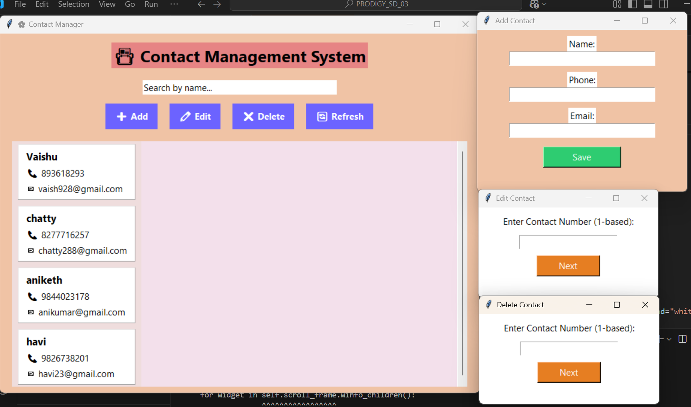

# 📇 Contact Management System | PRODIGY_SD_03

A beautifully designed, animated **Contact Management System** built with **Python** and **Tkinter**.
This GUI-based application allows users to **add**, **view**, **edit**, **delete**, and **filter** contact information with smooth animations and clean interface styling.

---

## 🎯 Features

✨ Elegant and colorful **Tkinter GUI**  
➕ Add new contacts (Name, Phone, Email)  
📖 View complete contact list  
✏️ Edit any existing contact  
❌ Delete contact using index  
🔍 Real-time **search/filter** contacts  
💾 Auto-saves data to a file (`contacts.json`) for persistence  
🎨 Beautiful font, hover effects, and creative design  

---

## 🖼️ Output Preview


## 🛠️ Tech Stack

- 🐍 Python 3
- 🖼️ Tkinter (for GUI)
- 📁 JSON (for contact data storage)

---

## 👩‍💻 Developed by

**Vaishnavi Lalan**
       Aspiring Developer | Intern at Prodigy Infotech |
      🔗[Linkedin](www.linkedin.com/in/vaishnavi-lalan-270419310) | [Github](https://github.com/VaishnaviLalan106)

📂 Folder Structure
```
contact-management-system/
├── contact_manage.py       
├── contacts.json            
├── README.md                
└── image.png   
```

---
